## Latest Features Added

1. **Camera Option for Ticket Scanning**
  - Allows entry validation using device camera to scan tickets.

2. **QR Code Fallback for Ticket Validation**
  - Provides an alternative QR code scanning method if camera scanning fails.

3. **Real-time Notifications for Ticket Scan and Entry Status**
  - Instantly notifies users and staff about scan results and entry status.

4. **Commission Calculation for Admin on Successful Bookings**
  - Automatically calculates and displays admin commission for each booking.

5. **Downloadable Transaction and Earnings Reports**
  - Enables CSV export of transaction and earnings data for Admin and Vendor dashboards.

6. **Enhanced Vendor Analytics Dashboard**
  - New charts, filters, and metrics for vendors to analyze sales and performance.

7. **Refund and Cancellation Request Interface**
  - UI for users to request refunds or cancellations, with backend processing.

8. **Camera Scan Logs for Audit and Security**
  - Stores logs of all camera-based scans for security and audit purposes.

9. **Export and Print Options for Scan Logs**
  - Allows exporting and printing of scan logs for record-keeping.

10. **Improved Email Notification System**
   - Enhanced reliability and formatting of email notifications for booking, payment, and status updates.

11. **Email Debugging Toolkit**
   - Tools and documentation for testing and troubleshooting email delivery and formatting issues.

12. **Automatic Booking and Payment Status Updates**
   - System automatically updates booking and payment statuses based on transaction results.

13. **Transaction History with Filtering**
   - Admin and Vendor dashboards now support advanced filtering of transaction history.
---

Logbook: 15  
Meeting No: 15   Date: 2026/03/30  
Start Time: 08:30 AM   End Time: 09:00 AM  
Items Discussed:  
• Demonstrated commission calculation for Admin on successful bookings.  
• Showed new camera-based ticket scanning feature for entry validation.  
• Reviewed downloadable transaction and earnings reports for Admin dashboard.  
• Discussed improvements to vendor-side analytics and reporting.  
• Explored user feedback on payment and booking flow.  
Achievements:  
• Integrated camera option for ticket scanning at entry points.  
• Enabled commission calculation and display in Admin dashboard.  
• Added downloadable CSV reports for transactions and earnings.  
• Improved vendor analytics with new charts and filters.  
Problems:  
• Minor issues with camera permissions on some devices, workaround identified.  
• Need to enhance error handling for failed ticket scans.  
Tasks for the Next Meeting:  
• Implement QR code fallback for ticket validation.  
• Add real-time notifications for scan results and entry status.  
• Refine vendor analytics dashboard based on feedback.  
• Begin work on refund and cancellation request UI.  
…………………   …………….…………………  
Asim Sapkota   Sandesh Hamal Thakuri  
(1st Supervisor)

---

Logbook: 16  
Meeting No: 16   Date: 2026/04/06  
Start Time: 08:30 AM   End Time: 09:00 AM  
Items Discussed:  
• Demonstrated QR code fallback for ticket validation.  
• Showed real-time notifications for ticket scan and entry status.  
• Reviewed updated vendor analytics dashboard with new metrics.  
• Presented initial refund and cancellation request UI.  
• Discussed integration of camera scan logs for audit purposes.  
Achievements:  
• Successfully implemented QR code fallback for ticket scanning.  
• Enabled real-time notifications for entry validation events.  
• Enhanced vendor analytics with additional metrics and export options.  
• Developed and tested refund/cancellation request interface.  
• Integrated camera scan logs for security and audit tracking.  
Problems:  
• Occasional delay in real-time notification delivery, optimization planned.  
• Some users reported confusion with new refund UI, further UX review needed.  
Tasks for the Next Meeting:  
• Optimize notification delivery for ticket scan events.  
• Conduct user testing on refund/cancellation UI and iterate design.  
• Add export and print options for scan logs.  
• Plan for final round of system integration testing.  
…………………   …………….…………………  
Asim Sapkota   Sandesh Hamal Thakuri  
(1st Supervisor)
## Activity Diagram: User Registration

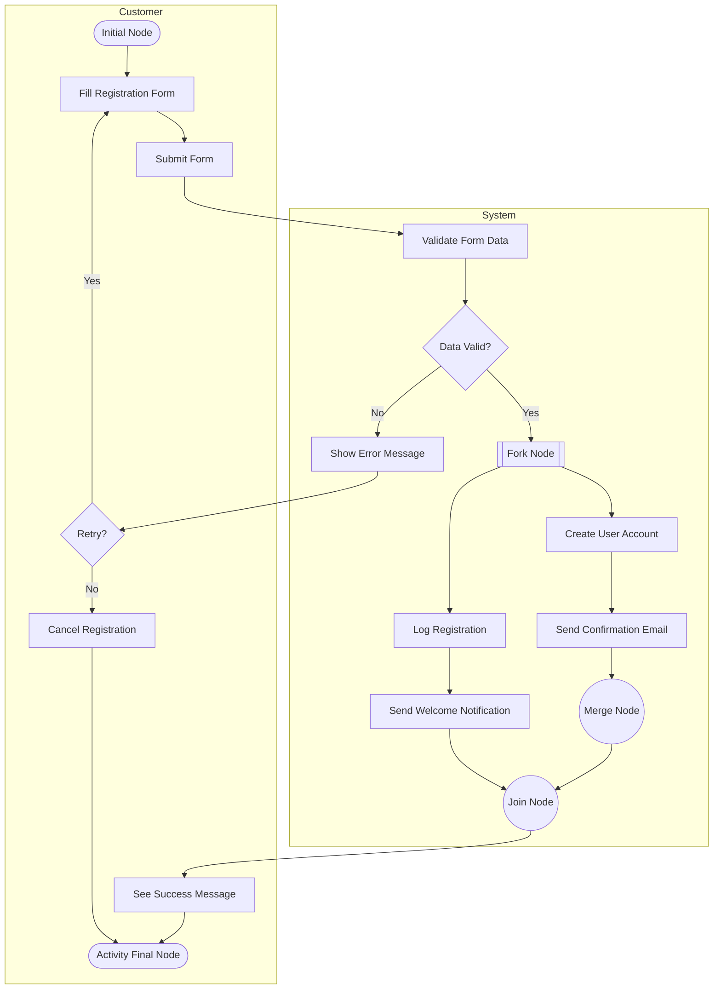

**Notations Used:**
- **Initial Node**: Start of the process
- **Activity State**: Actions like filling form, validation, etc.
- **Control Flow**: Arrows between actions
- **Decision Node**: “Data Valid?” and “Retry?” for branching
- **Merge Node**: Merges flows after confirmation email and parallel logging
- **Fork Node**: Splits into “Create User Account” and “Log Registration” in parallel
- **Join Node**: Joins parallel flows before showing success
- **Activity Final Node**: End of the process

# Mero Ticket Project - Comprehensive Flowchart Documentation

## Overview
This document contains 15 detailed flowcharts covering all major business processes and workflows in the Mero Ticket application. These flowcharts serve as the final report documentation for the project.

---

## 1. User Registration and OTP Verification Flow

**Purpose**: Documents the entire user signup process from phone number validation through OTP verification and account creation.

**Key Components**:
- Phone number uniqueness validation
- OTP generation and delivery (SMS/Email)
- OTP verification with expiry handling
- User account creation
- Referral code generation
- Signup metadata tracking (IP, User Agent, Device Fingerprint)

**Status Outcomes**: Registration Complete or Error

---

## 2. Ticket Booking Flow

**Purpose**: Covers the complete ticket booking process from show selection to booking confirmation.

**Key Components**:
- Movie and show selection
- Seating layout visualization
- Seat availability check
- 30-minute seat lock mechanism
- Price calculation with pricing rules
- Coupon/discount application
- Payment processing
- Ticket generation and confirmation

**Status Outcomes**: Booking Complete or Booking Failed

---

## 3. Payment Processing and Verification

**Purpose**: Handles payment gateway integration, transaction verification, and payment status management.

**Key Components**:
- Transaction ID generation
- Payment record creation (PENDING status)
- Gateway communication
- Server-side transaction verification
- Manual review for mismatches
- Wallet balance updates
- Booking record finalization

**Status Outcomes**: Payment Success, Failed, or Manual Review Required

---

## 4. Ticket Validation and Scanning

**Purpose**: Manages venue check-in process, ticket validation, and attendance tracking.

**Key Components**:
- QR code/Ticket ID scanning
- Ticket details retrieval
- Booking status verification
- Show time validation
- Duplicate entry prevention
- Validation record creation
- Attendance tracking

**Status Outcomes**: Entry Granted or Entry Denied

---

## 5. Refund Processing

**Purpose**: Manages refund requests with cancellation policy enforcement.

**Key Components**:
- Cancellation policy window check
- Show status verification
- Refund amount calculation
- Cancellation charge application
- Booking status update (CANCELLED)
- Seat release to pool
- Original payment method refund
- Refund ledger entry creation

**Status Outcomes**: Refund Approved, Denied, or Pending

---

## 6. Wallet and Transaction Management

**Purpose**: Manages user wallet operations and transaction ledger.

**Key Components**:
- Transaction type routing (Credit, Debit, Referral, Loyalty)
- Wallet balance updates
- Immutable ledger entry creation
- Transaction status validation
- Notification queueing
- Balance reconciliation

**Status Outcomes**: Transaction Complete or Rejected

---

## 7. Food Ordering Flow

**Purpose**: Handles food item selection and ordering integrated with ticket booking.

**Key Components**:
- Food menu browsing
- Item selection and cart management
- Food price calculation
- Discount application
- Tax calculation
- Order confirmation
- Kitchen system integration
- User notification

**Status Outcomes**: Order Success or Order Failed

---

## 8. Vendor Onboarding and Activation

**Purpose**: Complete vendor registration and activation process.

**Key Components**:
- Application submission with business details
- Document upload (KYC, Bank Info)
- Admin application review
- Commission rate setting
- Vendor wallet creation
- Profile activation
- Hall and Screen setup
- Movie and show management activation

**Status Outcomes**: Vendor Activated or Application Rejected

---

## 9. Vendor Payout and Withdrawal Process

**Purpose**: Manages vendor earnings withdrawal with compliance checks.

**Key Components**:
- Minimum balance verification
- Bank account validation
- Withdrawal amount calculation with fees
- Admin manual review for fraud detection
- Bank transfer initiation
- Settlement tracking (2-5 business days)
- Transfer verification
- Wallet debit confirmation
- User notification

**Status Outcomes**: Withdrawal Completed, Rejected, or Failed

---

## 10. Admin Dashboard and Control Panel

**Purpose**: Overview of admin functions and system management capabilities.

**Key Components**:
- Movie and show management
- Pricing rule configuration
- Commission and revenue settings
- Dashboard analytics and reporting
- Booking and revenue monitoring
- User and admin management
- Refund request processing
- Vendor and staff management
- Payment and transaction monitoring
- Loyalty and rewards management
- Audit logging and reporting

**Status Outcomes**: System Configured and Monitored

---

## 11. Referral System and Rewards

**Purpose**: Manages user referral program with fraud prevention.

**Key Components**:
- Referral code generation and sharing
- Code validation and self-referral detection
- Friend signup verification
- Welcome bonus creation
- 7-day hold period enforcement
- Spending threshold validation
- Reward release to both users
- Wallet transaction creation
- User notification

**Status Outcomes**: Referral Completed or Cancelled

---

## 12. Notification System

**Purpose**: Handles all system notifications via multiple channels.

**Key Components**:
- Event-triggered notifications
  - Booking confirmation
  - Payment receipt
  - Refund confirmation
  - Pre-show reminders
  - Loyalty points credit
- Channel selection (SMS, Email, Push)
- Message queuing
- Delivery with retry logic
- Status tracking and logging

**Status Outcomes**: Notification Sent or Delivery Failed

---

## 13. Loyalty Program and Rewards Redemption

**Purpose**: Manages loyalty points earning and redemption.

**Key Components**:
- Points calculation based on spend
- User tier checking (Silver/Gold/Platinum)
- Tier multiplier application
- Loyalty transaction creation
- Active promotion checking
- Bonus points application
- Reward selection and validation
- Points deduction
- Redemption record creation
- Reward delivery

**Status Outcomes**: Points Credited or Reward Redeemed

---

## 14. Movie & Show Management

**Purpose**: Complete movie and show creation workflow.

**Key Components**:
- Movie details input (Title, Genre, Rating)
- Poster and cast photos upload
- Cast and crew information
- Content rating assignment
- Description and review management
- Show creation from movies
- Venue and screen assignment
- Seating layout configuration
- Base pricing setup
- Dynamic pricing rules
- Commission configuration
- Publication and activation
- Promotion management

**Status Outcomes**: Show Published or Draft Saved

---

## 15. Role-Based Access Control (RBAC)

**Purpose**: Enforces authorization and access control across the system.

**Key Components**:
- JWT token extraction and validation
- Token signature and expiry verification
- User role fetching from database
- Role-specific permission checking
  - **User**: Own booking access, public data
  - **Admin**: Dashboard, user management, configuration
  - **Vendor**: Own show management, wallet access
- Resource ownership verification
- Access grant or denial
- Audit logging
- Error responses (401 Unauthorized, 403 Forbidden)

**Status Outcomes**: Access Granted or Access Denied

---

## Data Models Involved

The flowcharts reference the following key models:
- **User**: Users, Admin, Vendor, VendorStaff
- **Content**: Movie, Person, MovieCredit, Show, Screen, Seat
- **Booking**: Booking, BookingSeat, Ticket, TicketValidationScan
- **Payment**: Payment, Transaction, Refund
- **Wallet**: Wallet, UserWallet, AdminWallet, ReferralWallet, UserLoyaltyWallet
- **Ledger**: VendorCommissionLedger, RefundLedger, ReversalLedger, WithdrawalLedger
- **Loyalty**: LoyaltyProgramConfig, LoyaltyTransaction, Reward, RewardRedemption
- **Notification**: Notification
- **Food**: FoodItem, BookingFoodItem

---

## System Architecture Layers

### Frontend (React/Vite)
- User Interface for all customer-facing flows
- Admin dashboard for management functions
- Vendor portal for show and inventory management

### Backend (Django)
- API endpoints for all flows
- Business logic and validation
- Database transaction management
- Payment gateway integration

### Database
- Relational data models
- Ledger-based financial tracking
- Queue tables for background jobs

### External Integrations
- Payment Gateway (Payment verification)
- SMS/Email Gateway (OTP, Notifications)
- Banking APIs (Vendor payouts)

---

## Critical Business Rules Enforced

1. **Payment Verification**: Server-side validation before booking finalization
2. **Seat Locking**: 30-minute hold with automatic release
3. **Cancellation Policy**: Time-based and status-based refund rules
4. **Referral Fraud Prevention**: Self-referral detection, device fingerprinting, spending thresholds
5. **Wallet Ledger**: Immutable transaction history for financial audits
6. **Role-Based Access**: JWT-based authentication with granular permissions
7. **Vendor Compliance**: KYC, bank verification, manual review for withdrawals
8. **Loyalty Tiers**: Dynamic point multipliers based on user tier
9. **Notification Retries**: Exponential backoff for failed deliveries
10. **Audit Logging**: All critical operations logged for compliance

---

## Future Enhancement Opportunities

Based on the FEATURES_CORRECTIONS_IMPROVEMENTS.md document:

1. **Settlement Lifecycle**: Vendor payout schedules and reconciliation jobs
2. **Chargeback Handling**: Dispute management workflow
3. **Advanced Fraud Detection**: Machine learning for risky booking detection
4. **Audit Trails**: Enhanced logging for admin configuration changes
5. **Dynamic Pricing**: Rule simulation and explainability
6. **Subscription Plans**: Renewal reminders and compatibility checks
7. **Corporate Bookings**: Bulk seat holds and organization-level billing
8. **Vendor Analytics**: Revenue dashboards and performance metrics
9. **Performance Optimization**: Redis caching for aggregates and background jobs
10. **Security Enhancements**: Short-lived tokens, refresh token rotation, rate limiting

---

## Document Version

- **Created**: April 2026
- **Total Flowcharts**: 15
- **Project**: Mero Ticket - Final Report Documentation

---

## How to Use This Documentation

1. **For Development**: Use flowcharts as reference during feature development
2. **For Testing**: Map test cases to flowchart decision points
3. **For Onboarding**: Help new team members understand system processes
4. **For Stakeholders**: Provide visual representation of business logic
5. **For Architecture Review**: Identify bottlenecks and optimization opportunities

---

## Collaboration Diagrams

The diagrams below use collaboration (communication) format: participant/object nodes with numbered message links, aligned to the provided use case model.

### 1. Collaboration Diagram - Register Account

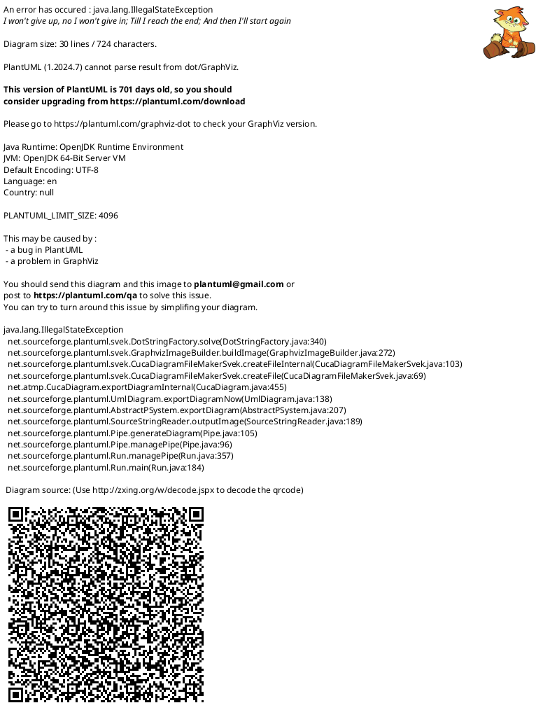

### 2. Collaboration Diagram - Browse Movies & Shows

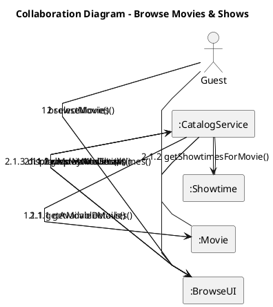

### 3. Collaboration Diagram - Book Ticket

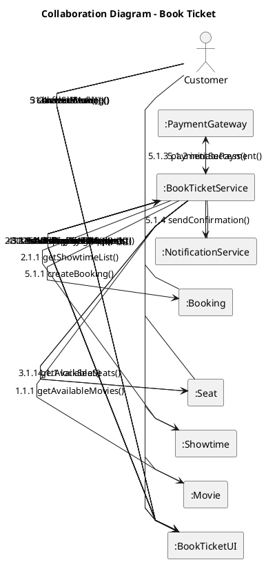

### 4. Collaboration Diagram - Cancel Booking / Process Refund

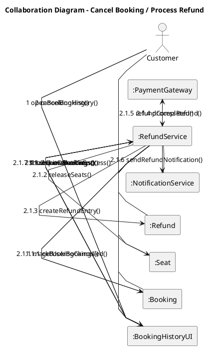

### 5. Collaboration Diagram - Manage Shows & Schedule

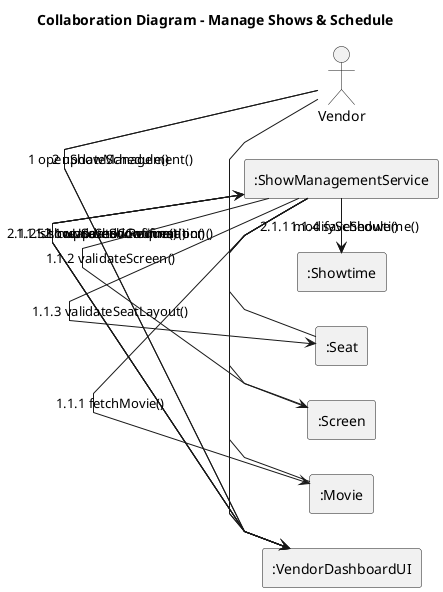

### 6. Collaboration Diagram - Food Ordering Flow

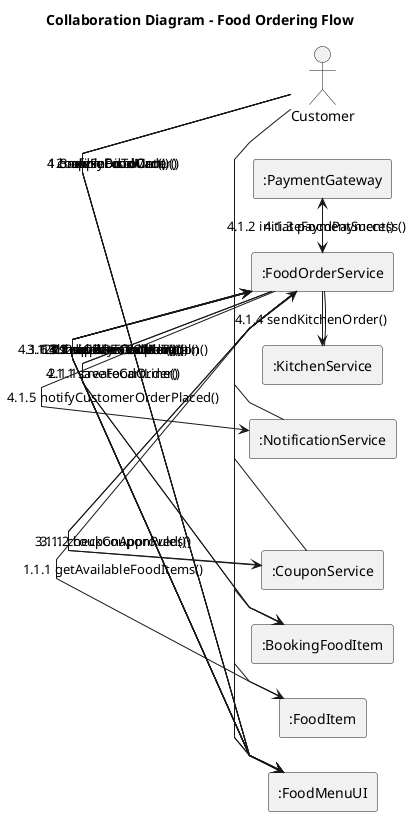

### 7. Collaboration Diagram - Vendor Payout and Withdrawal Process

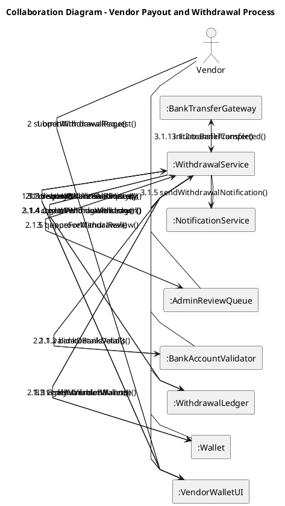

---

## Sequence Diagrams

These are true sequence diagrams with lifelines and ordered interactions.

### 1. Sequence Diagram - Login

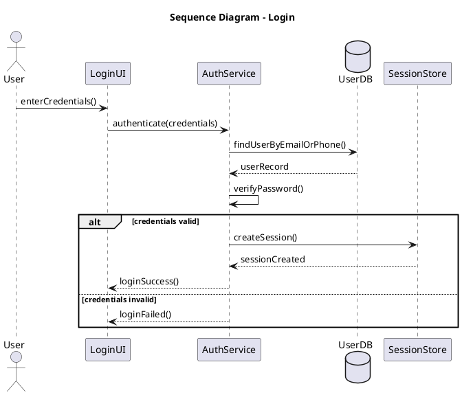

### 2. Sequence Diagram - Forgot/Reset Password

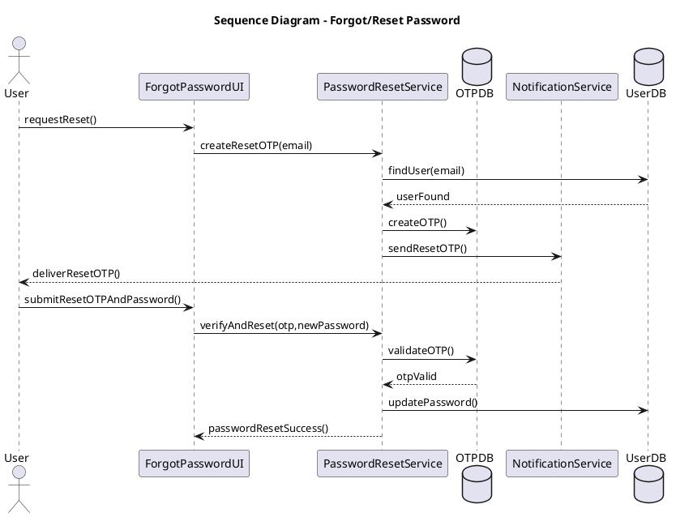

### 3. Sequence Diagram - Search Movies

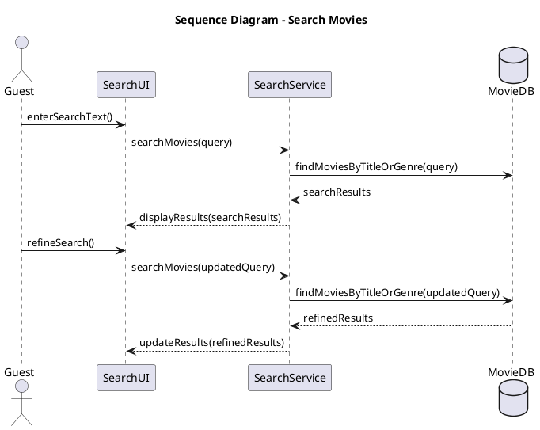

### 4. Sequence Diagram - View Movie Details

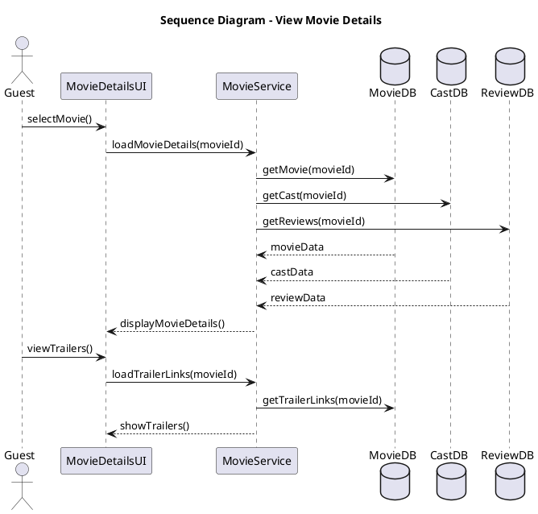

### 5. Sequence Diagram - View Notifications

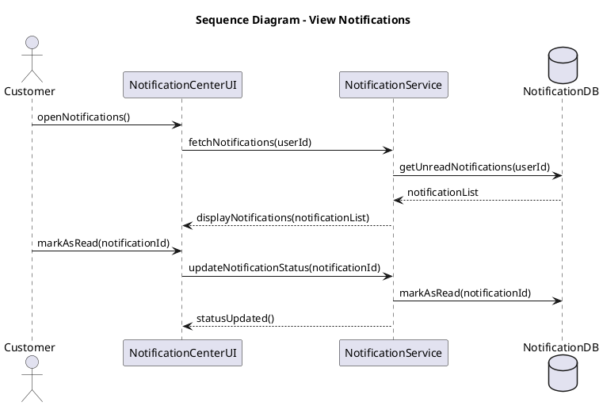

---

## Activity Diagrams

These are true activity diagrams with decision paths and flow control.

### 1. Activity Diagram - Payment Activity

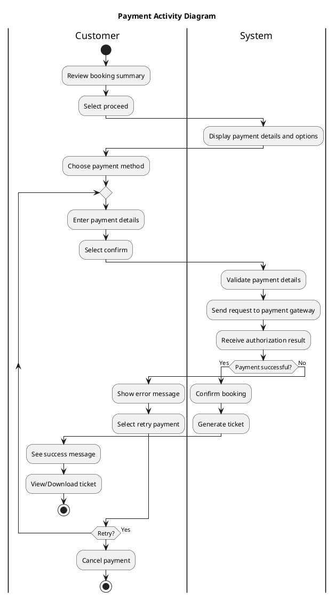

### 2. Activity Diagram - Manage Users and Vendors

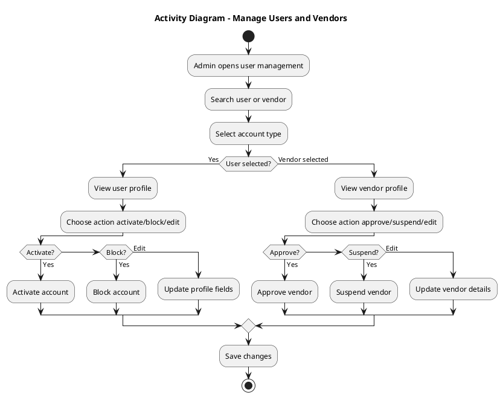

### 3. Activity Diagram - Manage Coupons and Global Pricing Rules

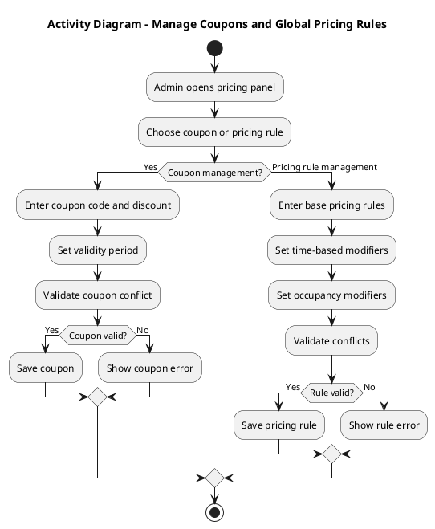

### 4. Activity Diagram - Manage Referral Controls

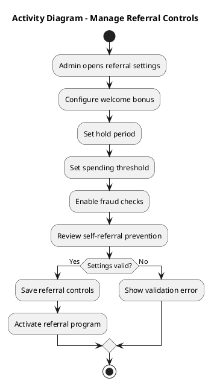

### 5. Activity Diagram - Manage Loyalty, Rewards, Promotions

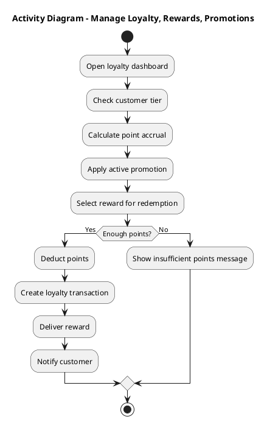

